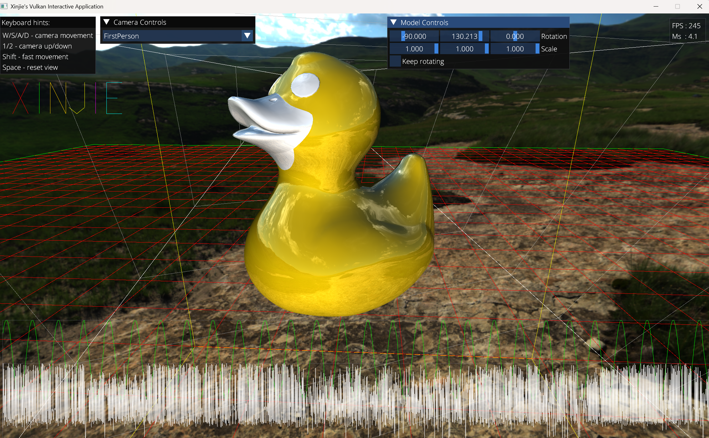
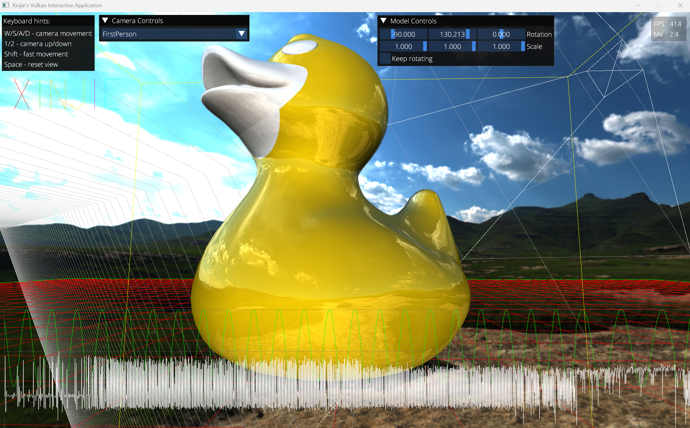
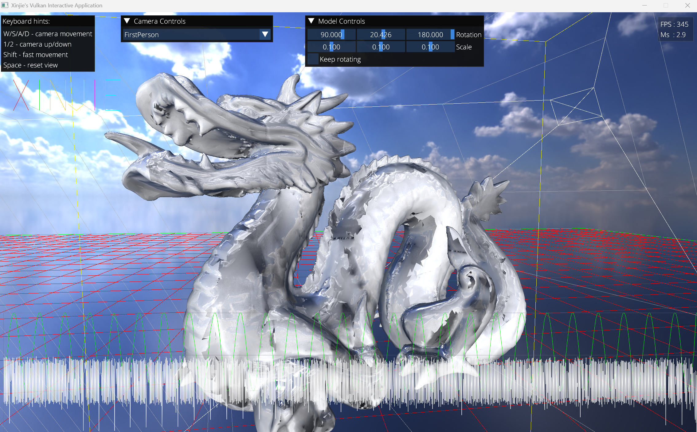
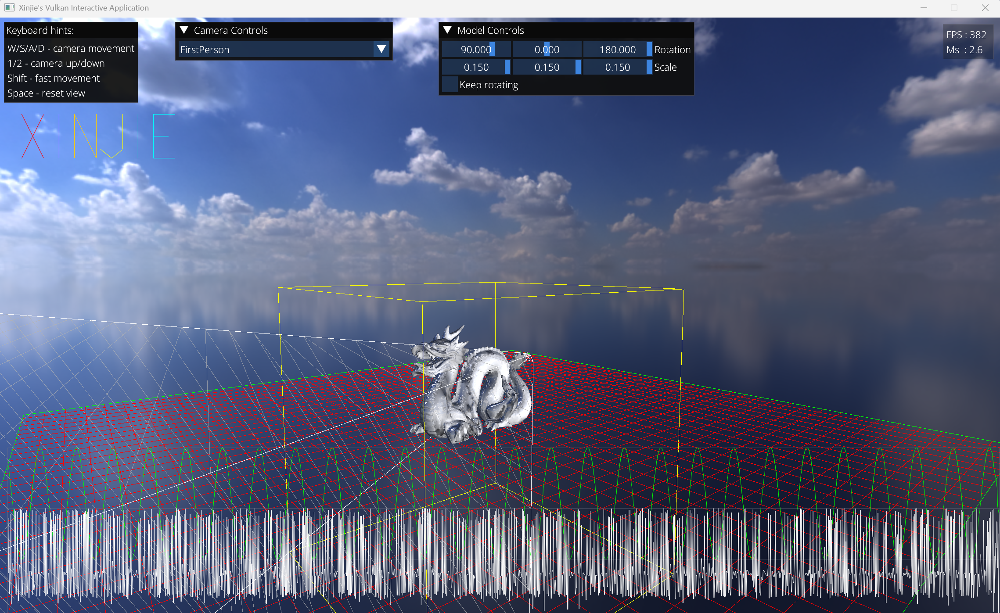

# Vulkan-3D-Interactive-Application
## Author: Xinjie Zhu
### Project Description

My second Vulkan graphics application is a 3D demo containing model import, camera controls, model transformation controls, cube map skybox, ambient reflection and debug lines. This Vulkan application is built on the Sergey Kosarevsky's LightweightVK Vulkan framework, and also combined with my own Vulkan rendering engine code from my first Vulkan App <a href="https://github.com/BZ85/Vulkan-Custom-Renderer" table = "_blank"> (click to access it)</a>. The Vulkan backend code of the project wraps the raw Vulkan API code, and builds the Vulkan rendering engine.  

The low level Vulkan rendering engine implements the bindless rendering using advanced features introduced in Vulkan 1.3. It uses descriptor indexing for texture access and GPU device addressing for uniform and storage buffers. All the textures area stored in a global large descriptor set, and all uniform and storage buffers are accessed through device address by shaders but not bound descriptor sets, improving rendering performance by reducing CPU-GPU binding overhead.  

The application also integrates the ImGui and ImPlot library into the Vulkan rendering pipeline for UI rendering. It implements the interactive camera system, so that the user can click and drag mouse to rotate the camera, and press WASD keys to move it. The camera can also be moved to a specific state by the ImGui slide bars called "MoveTo".  

The model object can be controlled and transformed (rotating and scaling) by changing the Euler angles and scaling factors through the slide bar. Quaternions are internally used to handling the object rotation for avoiding the gimbal lock. Ambient reflection is implemented so that the surface of model reflects the skybox scenes.  

Another key feature for the application is the cube map skyboxes. The system automatically converts an input equirectangular HDR image to the vertical cross format firstly, and then convert it to a cubemap texture used for skybox rendering. This allows users to simply provide a standard equirectangular HDR environment map, eliminating the need for manual conversion to cubemap formats.

 <a href="https://drive.google.com/file/d/10BPK-osrdVUqoaXFnpjm2SpMG743p18r/view?usp=sharing" table = "_blank"> Demo Video Link (Click here)</a>
 

 ### Yellow Duck Example 1

 There are both 3D lines and 2D lines portrayed in the application.  
 3D lines include grids, a cube and a rotating camera frustum for debugging shadow mapping later.  
 2D lines include my name "Xinjie" on the top left, FPS and sin graph (for debugging) on the bottom. 
 There is also a FPS counter on the top right of the main viewport. 

  
  
   

  ### Yellow Duck Example 2
 
 From the screenshot, you can see the reflections of the skybox scenes appearing on the yellow duck's surface, which is the ambient reflection feature.  

 
  
   

 ### Dragon Example 1

 Here is another scene with a dragon model and a new equirectangular projection HDR image for cubemap skybox.

 
  
   

 ### Dragon Example 2

 Another perspective for dragon example.

   
    
     
    
### References
LightweightVK library is from https://github.com/corporateshark/lightweightvk?tab=License-1-ov-file  
